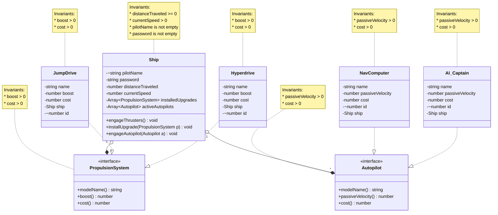

# Domain Model 

The following is my domain model for phase 2 of the Clicker project. 

### Change Log
##### Global Architecture & Database Modeling
- Added uniqueness constraints (`-~`) for primary/natural keys.
- Added bidirectional relationships to reflect SQL tables and foreign keys.

##### Ship Class
- Added `pilotName` (unique) and `password` for authentication.
- Added `activeAutopilots` and `engageAutopilot()`.
- Removed simple getters to reduce clutter.

##### PropulsionSystem (Click Upgrades)
- Added `cost()` and persisted `cost` field.
- Added `cost > 0` invariant.
- Added synthetic `id` to implementations.

##### Autopilot (Auto-Clickers)
- New `Autopilot` interface (`modelName`, `passiveVelocity`, `cost`).
- Implementations: `NavComputer`, `AI_Captain`
- Added synthetic `id` and `Ship` reference for DB structure.

