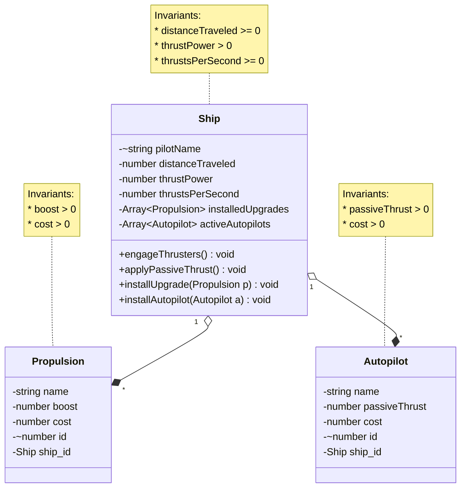

# Domain Model 

The following is my domain model for phase 2 of the Clicker project. 

### Change Log
#### Structural Changes (Inventory Support)
* Removed `PropulsionSystem` and `Autopilot` interfaces and their implementations (`JumpDrive`, `Hyperdrive`, `NavComputer`, `AI_Captain`)
* Replaced them with generic `Propulsion` and `Autopilot` classes for database driven configuration

#### Ship Class Updates
* Removed `password` property (use secure authentication instead)
* Replaced `currentSpeed` with `thrustPower`
* Added `thrustsPerSecond` for passive generation
* Updated invariants: `thrustPower > 0`, `thrustsPerSecond >= 0`
* Renamed `engageAutopilot` to `installAutopilot`
* Added `applyPassiveThrust` method

#### Propulsion and Autopilot Updates
* Renamed `passiveVelocity` to `passiveThrust`
* Renamed `ship` to `ship_id` (foreign key)

