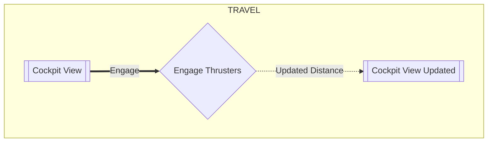
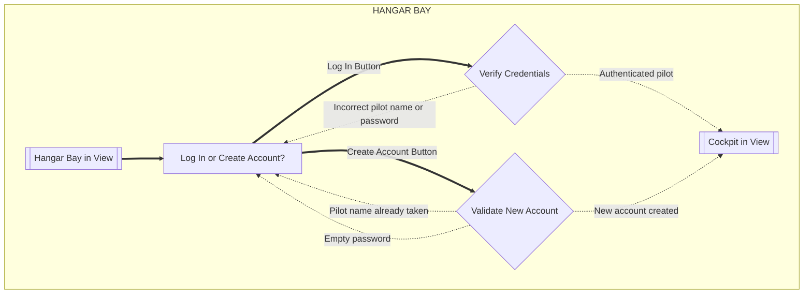
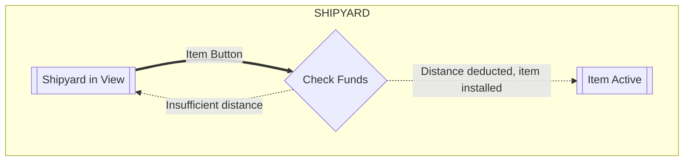

# Flow of Interaction Diagrams
The following are the 2 tasks as instructed by phase 2 of the Clicker project.

### Change Log
- Added Task 3: Account creation and login flow with error paths.
- Added Task 4: Generalized shipyard purchase flow (see note below).

# Phase 1

### Task 1

*Removed old Task 2 as Task 4 is the new generalized version*

# Phase 2

### Task 3 

### Task 4

> [!note]
> Purchasing a propulsion upgrade (JumpDrive / Hyperdrive) and purchasing an autopilot (NavComputer / AI_Captain) follow identical logic from the user's perspective.

